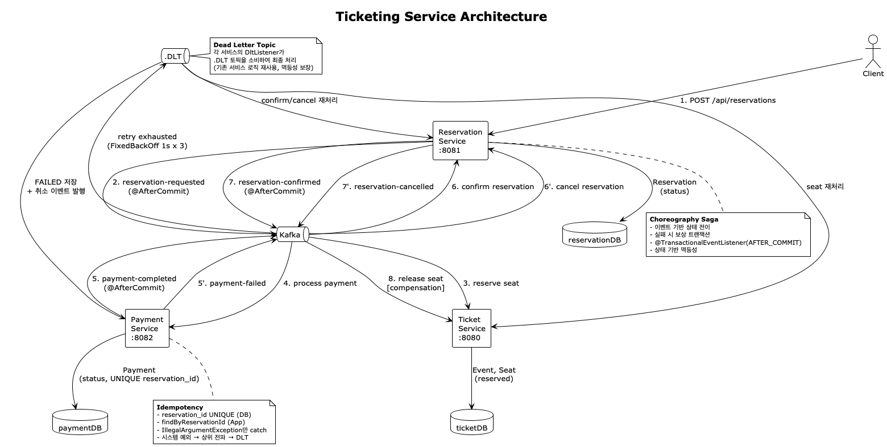
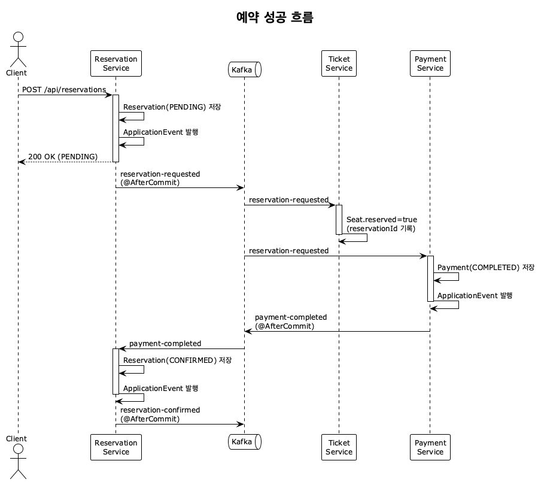
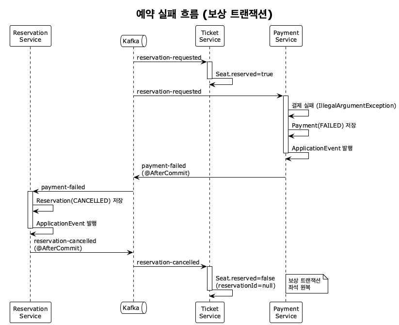
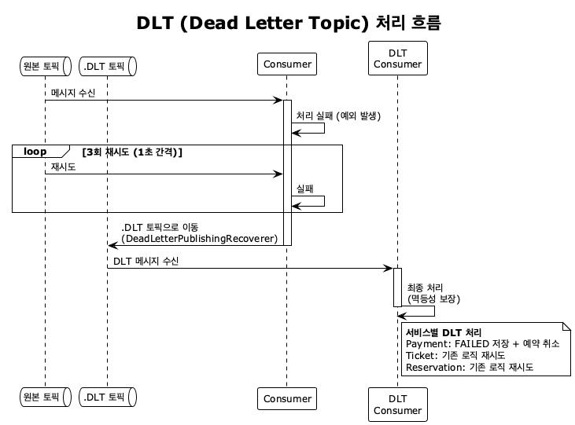
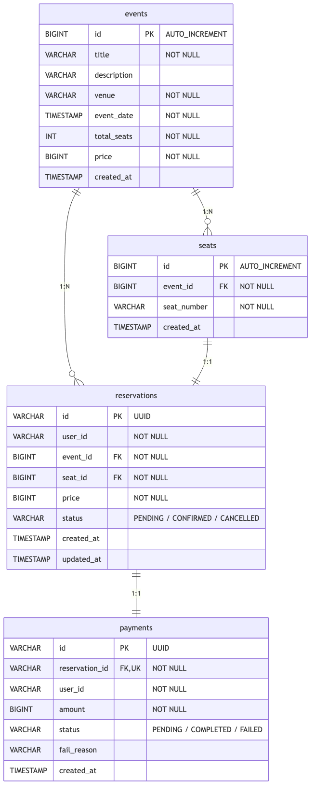

# Ticketing Service

Kafka 기반 Choreography Saga 패턴으로 동작하는 티켓 예약 시스템.
API Gateway + 3개의 독립된 마이크로서비스가 각자의 데이터베이스를 소유하며, 서비스 간 통신은 Kafka 이벤트로만 이루어진다.

## Architecture



## Tech Stack

| 구분        | 기술                                               |
|-----------|--------------------------------------------------|
| Language  | Java 17                                          |
| Framework | Spring Boot 3.2.5                                |
| Messaging | Apache Kafka (Confluent 7.5.0, 3-broker cluster) |
| Database  | H2 In-Memory (서비스별 독립 DB)                        |
| Cache     | Redis 7 (Spring Cache)                           |
| ORM       | Spring Data JPA                                  |
| Build     | Gradle (multi-module)                            |
| Test      | JUnit 5, Mockito, AssertJ                        |

## Module Structure

```
ticketing-service/
├── common/                          # 공유 모듈 (이벤트, 예외, 상수)
├── service-gateway/                 # API Gateway (인증/라우팅)
├── service-ticket/                  # 공연/좌석 관리
├── service-reservation/             # 예약 관리
├── service-payment/                 # 결제 처리
│
├── docker-compose.yml               # 인프라 (Redis + Kafka 클러스터)
├── http/                            # API 테스트 파일 (.http)
└── docs/                            # 다이어그램
    ├── architecture.puml            # 전체 아키텍처
    ├── sequence-diagram-success.puml # 예약 성공 흐름
    ├── sequence-diagram-failure.puml # 예약 실패 흐름
    ├── sequence-diagram-dlt.puml    # DLT 처리 흐름
    └── erd.mmd                      # ERD
```

## Getting Started

### Prerequisites

- Java 17+
- Docker & Docker Compose

### 1. 인프라 실행

```bash
docker-compose up -d
```

Redis 1대 + Zookeeper 1대 + Kafka 브로커 3대가 기동된다.

| 컴포넌트           | 포트    |
|----------------|-------|
| Redis          | 6379  |
| Zookeeper      | 2181  |
| Kafka Broker 1 | 9092  |
| Kafka Broker 2 | 19092 |
| Kafka Broker 3 | 29092 |

### 2. 환경 변수 설정

```bash
cp .env.example .env
```

```properties
H2_USERNAME=sa
H2_PASSWORD=your_password_here
REDIS_HOST=localhost
REDIS_PORT=6379
```

### 3. 애플리케이션 빌드 및 실행

```bash
# 빌드
./gradlew build

# 각 서비스 실행 (별도 터미널)
./gradlew :service-gateway:bootRun
./gradlew :service-ticket:bootRun
./gradlew :service-reservation:bootRun
./gradlew :service-payment:bootRun
```

| 서비스                 | 포트   | H2 Console                       |
|---------------------|------|----------------------------------|
| service-gateway     | 8089 | -                                |
| service-ticket      | 8080 | http://localhost:8080/h2-console |
| service-reservation | 8081 | http://localhost:8081/h2-console |
| service-payment     | 8082 | http://localhost:8082/h2-console |

## API Endpoints

### Ticket Service (`:8080`)

| Method | Endpoint                           | 설명               |
|--------|------------------------------------|------------------|
| `POST` | `/api/events`                      | 공연 생성 (좌석 자동 생성) |
| `GET`  | `/api/events`                      | 전체 공연 목록 조회      |
| `GET`  | `/api/events/{id}`                 | 공연 단건 조회         |
| `GET`  | `/api/events/{id}/seats`           | 전체 좌석 조회         |
| `GET`  | `/api/events/{id}/seats/available` | 잔여 좌석 조회         |

### Reservation Service (`:8081`)

| Method | Endpoint                                | 설명                 |
|--------|-----------------------------------------|--------------------|
| `POST` | `/api/reservations`                     | 예약 생성              |
| `GET`  | `/api/reservations/{id}`                | 예약 단건 조회           |
| `GET`  | `/api/reservations/me`                  | 내 예약 목록 조회         |
| `GET`  | `/api/admin/reservations/user/{userId}` | 관리자용 사용자별 예약 목록 조회 |

> API 테스트 파일: [`http/service-ticket.http`](./http/service-ticket.http), [
`http/service-reservation.http`](./http/service-reservation.http)
> `service-reservation`은 Gateway가 전달하는 `X-User-Id` 헤더를 사용한다.
> Gateway 호출 시에는 `Authorization: Bearer <JWT>` 헤더를 사용한다.

## Redis Cache

조회 성능 최적화를 위해 `service-ticket`, `service-reservation`에서 Redis 캐시를 사용한다.

### Cache TTL

| 서비스         | 캐시 이름               | 키               | TTL |
|-------------|---------------------|-----------------|-----|
| Ticket      | `events`            | `eventId`       | 30분 |
| Ticket      | `events-list`       | `all`           | 5분  |
| Ticket      | `available-seats`   | `eventId`       | 30초 |
| Reservation | `reservations`      | `reservationId` | 5분  |
| Reservation | `user-reservations` | `userId`        | 3분  |

### Cache Eviction

- `service-ticket`
    - `createEvent` 실행 시 `events-list` 전체 무효화
    - `reserveSeat`, `releaseSeat` 실행 시 해당 `available-seats::{eventId}` 무효화
- `service-reservation`
    - `createReservation` 실행 시 해당 `user-reservations::{userId}` 무효화
    - `confirmReservation`, `cancelReservation` 실행 시
        - `reservations::{reservationId}`
        - `user-reservations::{userId}`
          를 함께 무효화

## Gateway Policies

- 인증: `/api/**`는 JWT 인증 필수
- 권한: `POST /api/events/**`, `/api/admin/**`는 `ADMIN` 권한 필요
- 요청 제한: 기본 `60 req / 60 sec` (사용자 또는 IP 기준)

## Event Flow

### 예약 성공 흐름



### 결제 실패 흐름 (보상 트랜잭션)



### DLT 처리 흐름



### Kafka Topics

| Topic                   | Producer    | Consumer        | 설명            |
|-------------------------|-------------|-----------------|---------------|
| `reservation-requested` | Reservation | Ticket, Payment | 예약 요청         |
| `payment-completed`     | Payment     | Reservation     | 결제 성공         |
| `payment-failed`        | Payment     | Reservation     | 결제 실패         |
| `reservation-confirmed` | Reservation | —               | 예약 확정         |
| `reservation-cancelled` | Reservation | Ticket          | 예약 취소 (좌석 해제) |

> 메시지 키: `reservationId` — 동일 예약 건의 이벤트 순서를 파티션 내에서 보장

## Reliability

### Transactional Event Publishing

DB 트랜잭션과 Kafka 메시지 발행의 원자성을 위해 `@TransactionalEventListener(phase = AFTER_COMMIT)` 을 적용한다.

```
@Transactional 메서드
  └── DB 저장
  └── ApplicationEvent 발행 (Spring 내부)
        └── 트랜잭션 커밋 후 → KafkaTemplate.send() 실행
```

- DB 커밋이 실패하면 Kafka 메시지가 발행되지 않음
- DB 커밋 성공 후 Kafka 발행이 실패하는 케이스는 Transactional Outbox Pattern으로 개선 예정 (TODO)

### Idempotency (멱등성)

Kafka의 at-least-once 전송 보장으로 인한 중복 처리를 방지한다.

| 서비스           | 전략                                                                  |
|---------------|---------------------------------------------------------------------|
| Payment       | `reservation_id` UNIQUE 제약 (DB) + `findByReservationId` 체크 (애플리케이션) |
| Reservation   | 상태 기반 — 이미 CONFIRMED/CANCELLED 상태면 skip                             |
| Ticket (Seat) | `reservationId`를 기준으로 동일 예약의 중복 요청과 서로 다른 예약 간 충돌을 구분               |

### Dead Letter Topic (DLT)

재시도 3회 실패 시 `.DLT` 토픽으로 메시지를 이동시키고, 각 서비스의 DLT 컨슈머가 최종 처리한다.

| DLT Topic                   | Consumer    | 처리                               |
|-----------------------------|-------------|----------------------------------|
| `reservation-requested.DLT` | Payment     | Payment FAILED 저장 + 예약 취소 이벤트 발행 |
| `reservation-requested.DLT` | Ticket      | 좌석 예약 재시도 (멱등성 보장)               |
| `reservation-cancelled.DLT` | Ticket      | 좌석 해제 재시도                        |
| `payment-completed.DLT`     | Reservation | 예약 확정 재시도 (멱등성 보장)               |
| `payment-failed.DLT`        | Reservation | 예약 취소 재시도 (멱등성 보장)               |

### Error Handling

```
BusinessException (도메인 예외)
  └── GlobalExceptionHandler → ErrorResponse (에러 코드 + 메시지)

Exception (시스템 예외)
  └── GlobalExceptionHandler → ErrorResponse (내부 메시지 비노출)
  └── Kafka Consumer: 상위 전파 → 재시도 → DLT
```

| Error Code | Status | 설명          |
|------------|--------|-------------|
| 1000       | 404    | 공연을 찾을 수 없음 |
| 1100       | 404    | 좌석을 찾을 수 없음 |
| 1101       | 409    | 이미 예약된 좌석   |
| 1102       | 423    | 좌석 락 획득 실패  |
| 2000       | 404    | 예약을 찾을 수 없음 |
| 9000       | 400    | 잘못된 요청      |
| 9999       | 500    | 내부 서버 오류    |

## ERD

각 서비스가 독립된 H2 DB를 사용하며, 서비스 간 물리적 FK는 존재하지 않는다.



## Reservation Status Transition

```
PENDING ──(payment-completed)──▶ CONFIRMED
   │
   └────(payment-failed)───────▶ CANCELLED
```
